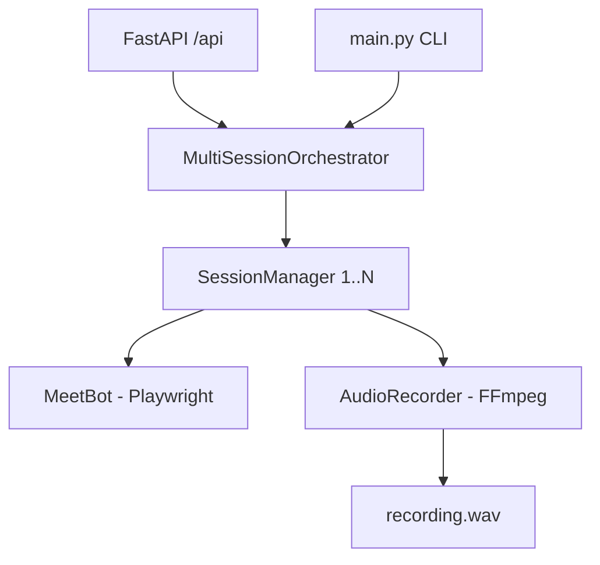

# Google Meet Recording Bot 🚀

An autonomous, multi-session Google Meet recording bot that joins meetings, captures high-fidelity digital audio, and manages sessions via a CLI or a FastAPI REST API.

---

## Key Features

- **Multi-Session Support**: Join and record multiple meetings concurrently, each with its own isolated browser profile.
- **Digital Audio Capture**: Uses **BlackHole** virtual drivers to record internal meeting audio directly (no microphone noise).
- **FastAPI REST API**: Control the bot remotely—start, stop, and monitor sessions via a modern API.
- **Headless Execution**: Runs in the background with minimal resource usage using Playwright.
- **Persistent Authentication**: Sign in once; the bot reuses cookies to skip login on all subsequent joins.

---

## 🛠 Architecture



---

## 📦 Prerequisites

### 1. System Dependencies (macOS)
The bot requires `ffmpeg` for recording and `BlackHole` for virtual audio routing.

```bash
brew install ffmpeg
brew install --cask blackhole-2ch
```

> [!IMPORTANT]
> After installing BlackHole, you **must restart your Mac** for the driver to be recognized by the system.

### 2. Audio Setup
To record the meeting, the audio must be routed to the virtual driver.
- **Option A (Silent)**: Set **System Settings → Sound → Output** to `BlackHole 2ch`. (You won't hear the meeting).
- **Option B (Hear + Record)**: Open **Audio MIDI Setup**, create a **Multi-Output Device** including your Speakers and BlackHole 2ch. Set this as your system output.

### 3. Python Dependencies
```bash
pip install -r requirements.txt
playwright install chromium
```

---

## ⚙️ Configuration

Copy `.env.example` to `.env` and configure your settings:

```env
GOOGLE_EMAIL=your@gmail.com
GOOGLE_PASSWORD=your_password  # Only for first-time seed-login
HEADLESS=true                  # Run in background
MAX_DURATION=14400             # Default max duration (4 hours)
AUDIO_DEVICE=BlackHole 2ch
```

---

## 🚀 Getting Started

### 1. First-Time Setup: Seed Login
Run this once to authenticate your Google account interactively.
```bash
python3 main.py seed-login
```
Sign in when the browser opens, then close it. Your session is now saved.

### 2. Running via CLI
Join one or multiple meetings immediately:
```bash
# Single URL
python3 main.py join https://meet.google.com/xxx-yyyy-zzz

# Multiple concurrent meetings
python3 main.py join https://meet.google.com/url-1 https://meet.google.com/url-2
```

### 3. Running as an API Service
Start the FastAPI server to control the bot via REST:
```bash
python3 main.py serve --port 8000
```
Visit `http://localhost:8000/docs` to see the interactive Swagger UI.

---

## 📡 API Endpoints

| Method | Endpoint | Description |
|---|---|---|
| `POST` | `/sessions/join` | Join a single meeting |
| `POST` | `/sessions/join-multi` | Join a list of meetings concurrently |
| `GET` | `/sessions` | List all active session IDs and URLs |
| `DELETE` | `/sessions/{id}` | Gracefully stop and save a recording |

---

## 📂 Project Structure

```
meeting_bot/
├── api/                # FastAPI logic (schemas, routes, app)
├── bot/                # Core automation engine
│   ├── orchestrator.py # Multi-session manager
│   ├── session_manager.py # Single session coordinator
│   ├── meet_bot.py     # Playwright/Meet automation
│   └── audio_recorder.py# FFmpeg recording logic
├── recordings/         # Output WAV files (16kHz mono PCM)
├── main.py             # CLI entrypoint
└── config.py           # Configuration loader
```

---

## 🧪 Development & Testing
Run tests to ensure everything is wired correctly:
```bash
pytest -v
```

---

## 🛡 Troubleshooting

- **"You can't join this video call"**: Google often blocks bots on first join. **Invite the bot's email** to the Google Calendar event for instant access.
- **Silent Recordings**: Ensure your System Sound Output is set to the Multi-Output device or BlackHole.
- **Login Expired**: Run `python3 main.py seed-login` again to refresh your session cookies.
